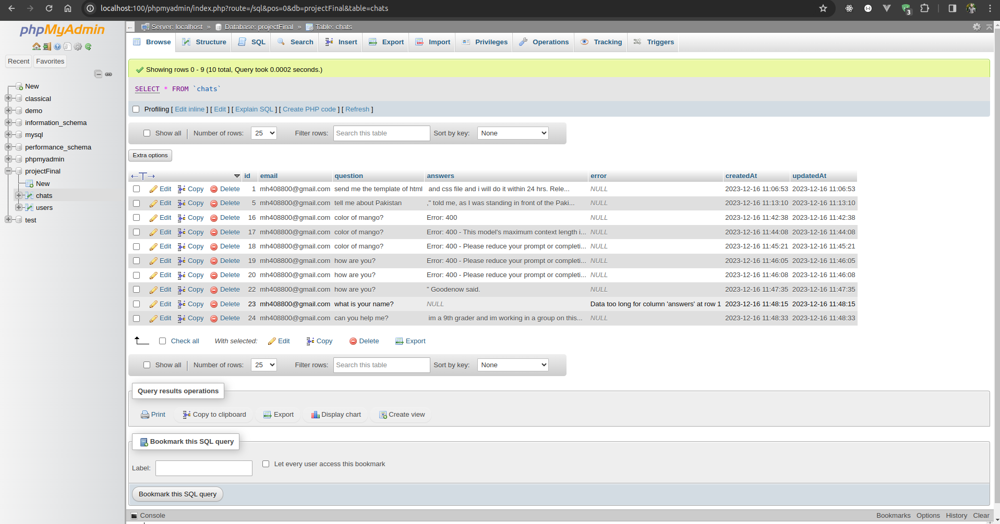
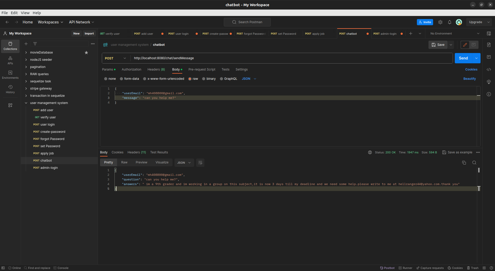
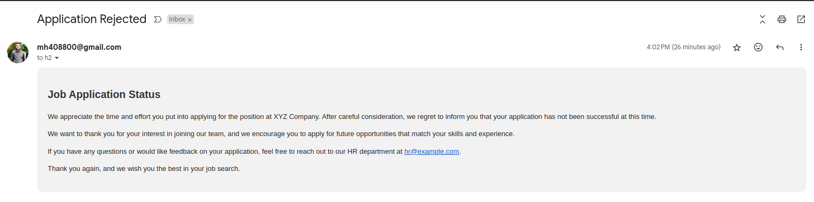

<!-- Database name -->
projectFinal

<!-- npm modules -->
1- sequelize
2- express
3- bcrypt => hashing the password
4- uuid => generating the remember token for verification
5- nodeMailer => sending the email
6- cors => interaction with frontend 
7- bull => background jobs
8- node-schedule => scheduler
9- express-rate-limit => limit the hit of Apis in the project
10- socket.io => for real time messaging as a chatbot
11- openai => for receiving the prompt and generating the responses.
12- multer => uploading the files
13- jsonwebtoken => for authentication and authorization
14- winston =. logging the logs

http://192.168.11.179:8080/user/verify-user
http://192.168.11.179:8080/user/login-user
http://192.168.11.179:8080/user/create-user
http://192.168.11.179:8080/job/apply-job
http://192.168.11.178:8080/user/admin-login

http://192.168.11.178:8080/user/verify/:email/:rememberToken

Email sent to h1@gmail.com