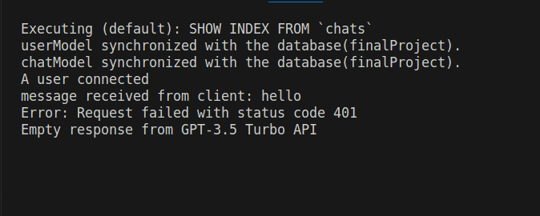
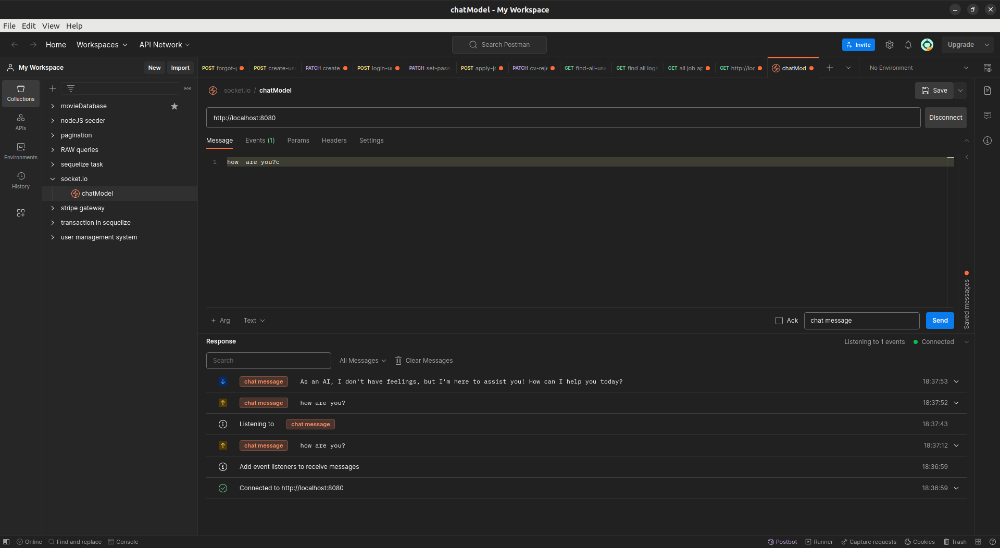

<!-- Database name -->
projectFinal

<!-- npm modules -->
1- sequelize
2- express
3- bcrypt => hashing the password
4- uuid => generating the remember token for verification
5- nodeMailer => sending the email
6- cors => interaction with frontend 
7- bull => background jobs
8- node-schedule => scheduler
9- express-rate-limit => limit the hit of Apis in the project
10- socket.io => for real time messaging as a chatbot
11- openai => for receiving the prompt and generating the responses.
12- multer => uploading the files
13- jsonwebtoken => for authentication and authorization
14- winston =. logging the logs

http://192.168.11.179:8080/api/user/login-user
http://192.168.11.179:8080/user/create-user
http://192.168.11.179:8080/api/user/create-password
http://192.168.11.179:8080/api/user/get-users
http://192.168.11.179:8080/api/user/reset-token
http://192.168.11.179:8080/api/user/change-user
http://192.168.11.179:8080/api/user/forgot-password
http://192.168.11.179:8080/api/user/set-user
http://192.168.11.179:8080/api/user/get-users

http://192.168.11.179:8080/api/job/apply-job
http://192.168.11.179:8080/api/job/get-applications
http://192.168.11.179:8080/api/job/cv/reject/:id
http://192.168.11.179:8080/api/job/cv/accept/:id

http://192.168.11.179:8080/api/log/activity-logs

<!-- pagination and filterations in http://192.168.11.179:8080/api/user/get-users -->
page - for the number of pages
pageSize - to show the number of records in a single page
searchTerm - for searching - firstName lastName email

<!-- pagination and filteration in http://192.168.11.179:8080/api/activity-logs -->
page - for the number of pages
pageSize - to show the number of records in  a single page
search : null
next page previous page added

<!-- http://localhost:8080/api/job/get-applications -->
page - for the number of pages
pageSize - to show the number of records in a single page
status for status such as rejected accepted pending - enum values
search in userName and email and applicantID as well